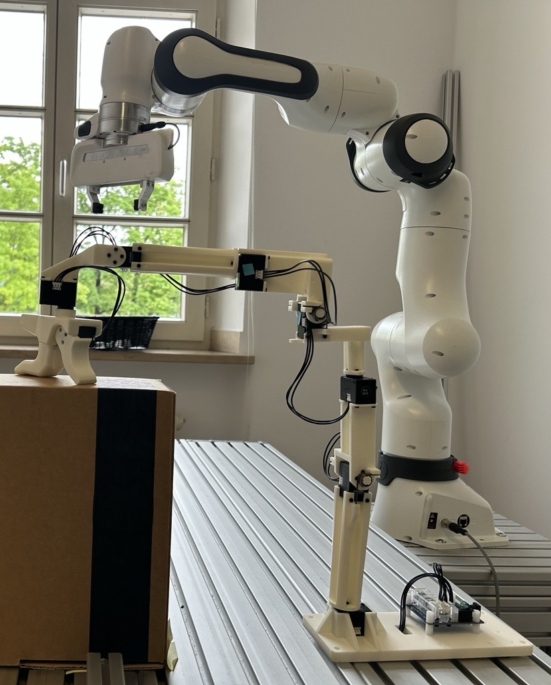

# GELLO 遥操作使用指南

## 1. 概述

GELLO 遥操作是一种基于舵机臂的遥操作方案，用于在 MuJoCo 仿真中控制 Franka 机械臂。支持单臂和双臂两种配置。

## 2. 系统要求

- Ubuntu 22.04 + ROS2 Humble
- Python 3.10+
- 物理 GELLO 舵机臂（通过 USB 连接）

## 3. 安装步骤

### 3.1 安装 gello_software（核心依赖）

选择一个您喜欢的安装目录（示例位置）：

```bash
# 创建安装目录（可自定义路径）
mkdir -p ~/gello_software
cd ~/gello_software

# 克隆 gello_software 仓库
git clone https://github.com/wuphilipp/gello_software.git gello_software

# 初始化并更新子模块（包含 Dynamixel SDK）
cd gello_software
git submodule init
git submodule update

# 安装仓库依赖
pip install -r requirements.txt --no-deps

# 安装 gello_software（开发模式）
pip install -e .

# 安装 Dynamixel SDK（使用仓库中的子模块版本）
pip install -e third_party/DynamixelSDK/python
```

> **说明**：如果你希望把依赖也尽量交给 conda 管理，可以先在环境里安装基础包（例如 `conda install -c conda-forge pip numpy scipy pyserial`），再执行后面的 `pip install -r requirements.txt` 和可编辑安装命令。

> **说明**：安装目录可自行选择，无需固定位置。建议选择非工作空间目录（如 `~/gello_software`），避免与 ROS2 工作空间冲突。

### 3.2 获取遥操作脚本

脚本已包含在 `multipanda_ros2` 仓库中：

```
~/dual_panda_ws/src/multipanda_ros2/gello_teleop/scripts/
├── gello_franka_ros2.py        # 双臂遥操作脚本
├── gello_franka_singlearm.py   # 单臂遥操作脚本
└── gello_smoother.py           # 平滑器
```

## 4. 硬件设置

### 4.1 连接 GELLO 舵机臂

将 GELLO 设备通过 USB 连接到电脑。

### 4.2 查看 USB 设备号

```bash
ls -l /dev/ttyUSB* /dev/ttyACM* 2>/dev/null
```

通常 GELLO 设备会被识别为 `/dev/ttyUSB0`。请确认脚本中设备路径是否正确。

### 4.3 设置权限（已有权限可跳过）

```bash
sudo chmod 666 /dev/ttyUSB0
# 或永久添加到 dialout 组（推荐）
sudo usermod -aG dialout $USER
newgrp dialout
```

## 5. 运行指南

### 5.1 双臂遥操作脚本

适用于控制双臂 Franka 机械臂，支持三种控制模式，带平滑功能。

**终端 1：启动双臂仿真**
```bash
source /opt/ros/humble/setup.bash
source ~/dual_panda_ws/install/setup.bash
ros2 launch franka_bringup dual_franka_sim.launch.py
```

**终端 2：启动双臂关节阻抗控制器**
```bash
source /opt/ros/humble/setup.bash
source ~/dual_panda_ws/install/setup.bash
ros2 run controller_manager spawner dual_joint_impedance_controller
```

**终端 3：启动双臂遥操作脚本**
```bash
source /opt/ros/humble/setup.bash
source ~/dual_panda_ws/install/setup.bash
cd ~/dual_panda_ws/src/multipanda_ros2/gello_teleop/scripts
python3 gello_franka_ros2.py
```

**控制模式**：编辑 `gello_franka_ros2.py` 中的 `CONTROL_MODE` 变量：

| 模式 | 值 | 说明 |
|------|-----|------|
| `LEFT_ARM`  | 1 | 只控制左臂，右臂保持默认位置 |
| `RIGHT_ARM` | 2 | 只控制右臂，左臂保持默认位置 |
| `BOTH_ARMS` | 3 | 双臂镜像控制（默认） |

### 5.2 单臂遥操作脚本

适用于控制单臂 Franka 机械臂，直接控制无需平滑。

**终端 1：启动单臂仿真**
```bash
source /opt/ros/humble/setup.bash
source ~/dual_panda_ws/install/setup.bash
ros2 launch franka_bringup franka_control_sim.launch.py controller_name:=joint_impedance_controller
```

**终端2 ：启动单臂遥操作脚本**
```bash
source /opt/ros/humble/setup.bash
source ~/dual_panda_ws/install/setup.bash
cd ~/dual_panda_ws/src/multipanda_ros2/gello_teleop/scripts
python3 gello_franka_singlearm.py
```

## 6. 标定说明

### 6.1 标定原理

GELLO 舵机臂的关节角度需要与 Franka 机械臂对齐。标定偏移存储在 YAML 配置文件中，脚本启动时自动加载。

配置文件位置：
```
~/dual_panda_ws/src/multipanda_ros2/gello_teleop/config/yam_auto_generated.yaml
```

配置文件格式：
```yaml
agent:
  port: "/dev/ttyUSB0"
  dynamixel_config:
    joint_ids: [1, 2, 3, 4, 5, 6, 7]
    joint_offsets: [3.14159, 3.14159, 0.0, 3.14159, 3.14159, 3.14159, 3.92699]
    joint_signs: [1.0, -1.0, 1.0, 1.0, 1.0, -1.0, 1.0]
```

### 6.2 重新标定步骤

**Step 1: 准备工作**
1. 将 GELLO 设备连接到电脑
2. 将 GELLO 摆放到**官方指定的标准标定姿态**：

   


**Step 2: 运行标定脚本**

```bash
cd ~/gello_software
python scripts/generate_yam_config.py \
  --output-path ~/dual_panda_ws/src/multipanda_ros2/gello_teleop/config/yam_auto_generated.yaml
```

**参数说明**：
- `--output-path`: 指定输出配置文件路径（必须指向工作空间内的配置文件）
- `--port`: 手动指定 USB 端口（如自动检测失败时使用）

**示例（手动指定端口）**：
```bash
python scripts/generate_yam_config.py \
  --port /dev/ttyUSB0 \
  --output-path ~/dual_panda_ws/src/multipanda_ros2/gello_teleop/config/yam_auto_generated.yaml
```

**Step 3: 验证标定结果**

启动遥操作脚本，观察终端输出的配置加载信息：
```bash
cd ~/dual_panda_ws/src/multipanda_ros2/gello_teleop/scripts
python3 gello_franka_singlearm.py
```

终端应显示：
```
Using package config: /home/botao/dual_panda_ws/src/multipanda_ros2/gello_teleop/config/yam_auto_generated.yaml
[INFO] [gello_franka_singlearm]: GELLO configuration loaded successfully
```

### 6.3 标定脚本功能说明

标定脚本会自动完成以下工作：
1. **端口检测**：自动查找 FTDI USB 设备，支持多设备选择
2. **偏移量计算**：遍历搜索使 GELLO 在标准姿势时读取角度最接近 0 的偏移量
3. **夹爪配置**：检测并记录夹爪的开合角度
4. **配置生成**：生成硬件和仿真两种配置文件

## 7. 话题说明

### 双臂脚本话题

| 话题 | 类型 | 说明 |
|------|------|------|
| `/dual_joint_impedance/joints_desired` | `Float64MultiArray` | 双臂关节目标（14个关节角度） |

### 单臂脚本话题

| 话题 | 类型 | 说明 |
|------|------|------|
| `/joint_impedance/joints_desired` | `JointState` | 单臂关节目标 |
| `/panda/joint_states` | `JointState` | 单臂关节状态反馈 |

## 8. 文件结构

```
~/dual_panda_ws/src/multipanda_ros2/
├── gello_teleop/
│   ├── config/
│   │   └── yam_auto_generated.yaml  # GELLO 标定配置文件
│   └── scripts/
│       ├── gello_franka_ros2.py     # 双臂遥操作脚本
│       ├── gello_franka_singlearm.py # 单臂遥操作脚本
│       └── gello_smoother.py         # 平滑器
└── docs/
    └── gello.md                     # 本说明文档
```

**版本**: v1.0
**最后更新**: May 2026